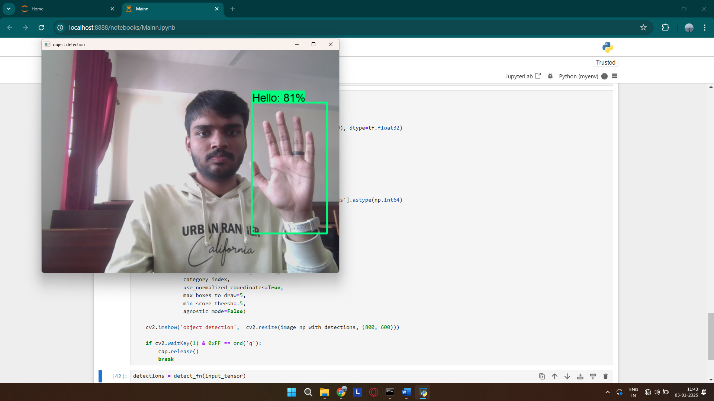

# Real-Time Sign Language Detector

**Real-Time Sign Language Detector** is a versatile Python application designed to detect and translate sign language gestures in real-time. The app uses **TensorFlow Object Detection API**, **OpenCV** for image capture, and **Transfer Learning** with a pre-trained SSD MobileNet model for efficient and accurate sign language gesture recognition.

## Features

- **Real-Time Detection**: Detect and classify sign language gestures from the webcam in real time.
- **Gesture Set**: Recognize five specific sign language gestures: "Hello", "Yes", "No", "Thank You", and "I Love You".
- **Transfer Learning**: The model is fine-tuned using transfer learning on a pre-trained SSD MobileNet model to detect gestures efficiently.
- **Labeling Tool**: Use the [LabelImg tool](https://github.com/tzutalin/labelImg) for manually labeling the dataset with bounding boxes.
- **TensorFlow Object Detection API**: Leverages TensorFlow's state-of-the-art object detection framework for training and inference.


## HIGHLY SUGGEST SETTING UP A VIRTUAL ENVIRONMENT FIRST AS THE DEPENDENCIES MAY CONFLICT WITH YOUR SYSTEM


## Installation

1. **Clone the repository:**
    ```bash
    git clone https://github.com/yourusername/sign-language-detector.git
    cd sign-language-detector
    ```

2. **Install dependencies:**
    Make sure you have Python 3.x installed, then install the required libraries:
    ```bash
    pip install -r requirements.txt
    ```

3. **Follow this tutorial to set up the project (Highly Recommended):**  
    👉 [YouTube - Real-Time Sign Language Detection with TensorFlow](https://youtu.be/pDXdlXlaCco?si=d7hXWSyMkA9gFauN)  
    This video walks through the setup, training, and implementation of the real-time sign language detector, and served as the main reference for this project.

## Usage

- **Real-Time Detection**: Open the webcam feed by running the detection script. The model will display the detected gesture and output the class label in real time.
- **Labeling Dataset**: Use the [LabelImg tool](https://github.com/tzutalin/labelImg) to label the images with bounding boxes for each gesture. The labeled data will be used to train the model.
- **Training the Model**: Fine-tune the SSD MobileNet model on your labeled dataset using the training script in the Mainn jupyter notebook.
- **Webcam Feed**: The real-time detection script will open your webcam, and the model will attempt to recognize the sign language gestures.

## Screenshots

### 🖼️ Real-Time Detection in Action
<p align="center">
  
</p>


## Contributing

Contributions are welcome! If you have any suggestions, bug fixes, or improvements, feel free to create a pull request or open an issue in the repository.

## Acknowledgements

- This project was developed for educational purposes as part of a real-time sign language detection application.
- Special thanks to the TensorFlow community for the Object Detection API and SSD MobileNet model.
- Thanks to the [LabelImg tool](https://github.com/tzutalin/labelImg) for helping with dataset labeling.

---

Feel free to reach out if you have any questions or want to contribute. Happy coding! 🖐️
